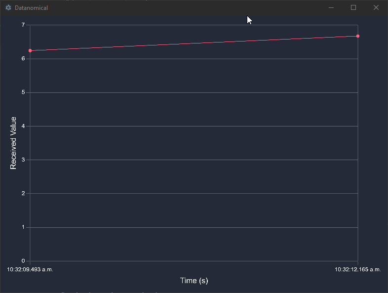

# Datanomical
A datalogging application that collects and visualises data sent via REST API or WebSocket API.  

Development is currently in progress.  

  

## Dependencies  
- Node.js v20.5.1  
- Chart.js v4.4.0  
- Yarn v1.22.18  
- chartjs-adapter-date-fns v3.0.0  

## Usage  

### Start application
``` 
yarn start  
``` 

### Build application
``` 
yarn make  
``` 

### POST
http://localhost:3000/data_ingest  

#### Example JSON  
``` 
{
	"name": "stream1",
	"time": 1693437360633,
	"value": 3
}  
``` 
Note this uses unix time.  

## Resources  
- https://www.electronjs.org/docs/latest/tutorial/quick-start  
- https://www.chartjs.org/docs/latest/getting-started/  
- https://stackoverflow.com/questions/39091964/remove-menubar-from-electron-app  
- https://daily-dev-tips.com/posts/javascript-recurring-timers-with-setinterval/  
- https://www.chartjs.org/docs/latest/configuration/device-pixel-ratio.html  
- https://www.chartjs.org/docs/latest/developers/updates.html  
- https://stackoverflow.com/questions/39091964/remove-menubar-from-electron-app  
- https://github.com/chartjs/chartjs-adapter-date-fns  
- https://chrome.google.com/webstore/detail/boomerang-soap-rest-clien/eipdnjedkpcnlmmdfdkgfpljanehloah/related  
- https://www.geeksforgeeks.org/implementation-queue-javascript/  
- https://stackoverflow.com/questions/34275287/how-to-send-just-a-200-response-in-express-js  
- https://stackoverflow.com/questions/39475891/add-dataset-bar-chart-chart-js  
- https://stackoverflow.com/questions/48143233/how-to-plot-multiple-time-series-in-chartjs-where-each-time-series-has-different  
- https://video-cutter-js.com/png2icojs/  
